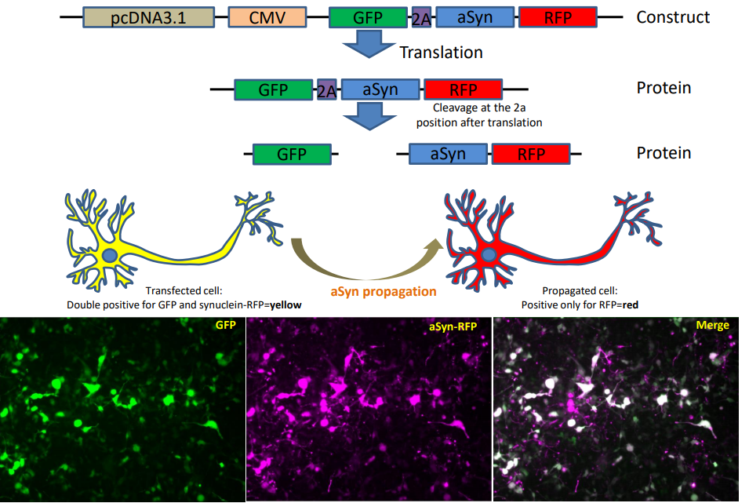

This is the code repository related to the manuscript 

@article{Kara2020Identification, author = {Eleanna Kara, Alessandro Crimi, Anne Wiedmer, Marc Emmenegger, Claudia Manzoni, Sara Bandres Ciga,  Regina Reynolds, Juan Botía, Manfredi Carta, Daniel Heinzer, Merve Avar, Andra Chincisan, Manuela Tan, Edwin Jabbari, Cornelis Blauwendraat, Sonia Garcia Ruiz, Daniel Pease, Jiang-An Yin, Lorene Mottier, Alessandra Carrella, Dezirae Schneider, Caroline Aemisegger, Zhanyun  Fan, Jordan Marks, Sarah Hopp, Huw Morris, Patrick Lewis, Mike Nalls, Mina Ryten, John Hardy, Bradley Hyman, Adriano Aguzzi}, title = {An integrated genomic approach to dissect the genetic landscape regulating the cell to cell transfer of a-synuclein/a-synuclein propagation}, booktitle = {  }, year = {  }, month = {  } }  

 

In this project, we are quantifying the degree of a-synuclein cell to cell transfer and if/how it is modulated by each gene within the genome. To this end, we are using a construct encoding GFP-2a-aSynuclein-RFP and we are quantifying the number of recipient cells (RFP+GFP-) normalized to the total number of transfected cells (RFP+GFP+).  

This repository comprises the scripts for the image analysis and graph generations.
The used images are available on http://figshare.com/...

The image analysis scripts are for the Matlab environment, while the picklist scripts are Python scripts.

the script run_all_RG.m calls iterates through the entire dataset computing features and plotting results,

the script red_vs_green.m is the function actually computing the features,

while plot_data.m is the function plotting and saving the heatmaps.

picklist.py and code_python_sRNA_screen.py are the files which map source and destination according to plate picklists reported in final_picklist.zip
